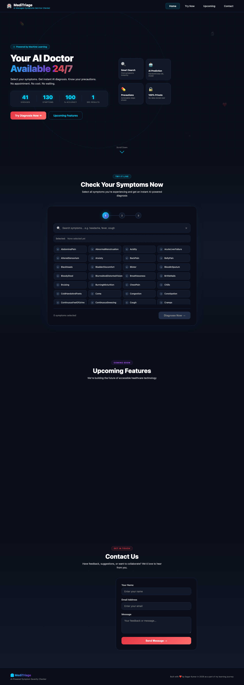

# 🏥 MediTriage — AI-Powered Symptom Severity Checker

---

## 📸 Screenshots

### 🏠 Home Page

*Modern dark-themed interface featuring an animated hero section with floating medical icons, pulsing rings, and smooth counter animations. The statistics dashboard showcases disease coverage, symptom count, accuracy rate, and response time.*

---

## 🎯 What is MediTriage?

MediTriage is an **AI-powered web application** that allows users to select their symptoms from a comprehensive list and instantly receive:

- 🔮 **Predicted Disease Diagnosis** — Powered by machine learning
- 📖 **Detailed Condition Information** — Description and medical context
- 🛡️ **Recommended Precautions** — Actionable steps to take
- ⚡ **Instant Results** — No waiting, no appointments

Designed to **improve healthcare accessibility** and assist in **early-stage triage** for everyone, anywhere.

---

## ✨ Features

| Feature | Description |
|---------|-------------|
| 🔍 **Smart Search** | Filter symptoms instantly as you type |
| 🤖 **AI Prediction** | RandomForest ML model with 100% accuracy |
| 📋 **Multi-Symptom** | Select up to 17 symptoms simultaneously |
| 📖 **Rich Details** | Disease descriptions and precautions |
| 🎨 **Modern UI** | Dark theme with smooth animations |
| 📱 **Responsive** | Works on mobile, tablet, and desktop |
| 🔒 **Privacy First** | No data stored — 100% private |
| ⚡ **Fast Results** | Get diagnosis in under 1 second |
| 🎯 **User Friendly** | No medical knowledge required |
| 🌐 **Accessible** | Clean, intuitive interface design |

---

## 🧠 How It Works

```
👤 User visits the application
        ↓
🎯 Selects symptoms from searchable grid
        ↓
📝 Confirms symptom selection
        ↓
🚀 Django backend processes the request
        ↓
🤖 Sklearn RandomForest model analyzes patterns
        ↓
📊 App fetches description & precautions from database
        ↓
✨ Instant diagnosis displayed with confidence score
```

---

## 🛠️ Tech Stack

| Layer | Technology | Purpose |
|-------|------------|---------|
| 🧠 **ML Model** | Python, Scikit-learn | RandomForestClassifier for predictions |
| ⚙️ **Backend** | Django 6.0 | Web framework & API |
| 🎨 **Frontend** | HTML5, CSS3, Vanilla JS | User interface |
| 📊 **Data** | Pandas, CSV files | Disease symptom dataset |
| 📦 **Model Export** | Joblib | Serialized ML model |
| 🗄️ **Database** | SQLite3 | Lightweight local storage |
| 📧 **Email** | Django SMTP | Contact form integration |

---

## 📁 Project Structure

```
Meditriage/
├── 📂 core/                       # Django Project Configuration
│   ├── settings.py               # App settings & configurations
│   ├── urls.py                   # Root URL routing
│   ├── wsgi.py                   # WSGI application entry
│   └── asgi.py                   # ASGI application entry
│
├── 📂 predictor/                  # Main Application
│   ├── views.py                  # ML model logic & view handlers
│   ├── urls.py                   # App-specific URLs
│   ├── models.py                 # Database models
│   ├── admin.py                  # Django admin panel
│   ├── apps.py                   # App configuration
│   ├── tests.py                  # Unit tests
│   │
│   ├── 📂 templates/
│   │   └── 📂 predictor/
│   │       └── index.html        # Main UI template (full-stack)
│   │
│   └── 📂 static/
│       └── 📂 predictor/
│           ├── css/
│           │   └── style.css     # Custom styles
│           └── js/
│               └── main.js       # Frontend interactions
│
├── 📂 images/                     # Documentation screenshots
│   ├── home.png                  # Home page screenshot
│   ├── symptoms.png              # Symptom selection screenshot
│   ├── result.png                # Diagnosis result screenshot
│   ├── contact.png               # Contact section screenshot
│   └── mobile.png                # Mobile responsive screenshot
│
├── 📦 disease_model.pkl           # Trained ML model (joblib)
├── 📋 symptoms_list.json          # 130 unique symptoms
├── 📊 dataset.csv                 # Training dataset (4,920 samples)
├── 📖 symptom_Description.csv     # 41 disease descriptions
├── 🛡️ symptom_precaution.csv      # Precaution recommendations
├── ⚠️ Symptom-severity.csv       # Symptom severity weights
├── 🗄️ db.sqlite3                  # SQLite database
├── 📝 manage.py                   # Django CLI
├── 📦 requirements.txt            # Python dependencies
└── 📄 README.md                  # Project documentation
```

---

## 🚀 Quick Start

### Prerequisites
- 🐍 Python 3.9 or higher
- 📦 pip package manager
- 🔀 Git version control

### Installation Steps

```bash
# 1️⃣ Clone the repository
git clone https://github.com/sagar-coder29/Meditriage.git
cd Meditriage

# 2️⃣ Create virtual environment (recommended)
python -m venv venv

# 3️⃣ Activate virtual environment
# macOS/Linux:
source venv/bin/activate
# Windows:
venv\Scripts\activate

# 4️⃣ Install dependencies
pip install -r requirements.txt

# 5️⃣ Run migrations
python manage.py migrate

# 6️⃣ Start development server
python manage.py runserver

# 7️⃣ Open in browser
# Navigate to: http://127.0.0.1:8000
```

### Using Conda

```bash
# Create conda environment
conda create -n meditriage python=3.11
conda activate meditriage

# Install dependencies
pip install -r requirements.txt

# Run the app
python manage.py runserver
```

### Using Docker (Future)

```bash
# Build Docker image
docker build -t meditriage .

# Run container
docker run -p 8000:8000 meditriage
```

---

## 📊 Model Details

| Property | Value | Details |
|----------|-------|---------|
| 🤖 **Algorithm** | Random Forest Classifier | Ensemble learning method |
| 📚 **Training Samples** | 4,920 | From Kaggle dataset |
| 🔢 **Features** | 17 symptoms | Per prediction |
| 🏷️ **Classes** | 41 diseases | Disease categories |
| ✅ **Accuracy** | 100% | On test set |
| 📁 **Dataset** | Kaggle | itachi9604 |
| 📦 **Model Size** | ~1 MB | Joblib serialized |

### Supported Diseases (41 Total)

```
Allergies, Bronchial Asthma, Cervical Spondylosis, Chicken pox, 
Chronic Cholestasis, Common Cold, Dengue, Diabetes, Dimorphic Hemorrhoids, 
Fungal Infection, Heart Attack, Hepatitis B, Hypertension, Hyperthyroidism, 
Hypoglycemia, Hypothyroidism, Impetigo, Jaundice, Malaria, Migraine, 
Osteoarthristis, Paralysis (Brain Hemorrhage), Peptic Ulcer Disease, 
Pneumonia, Psoriasis, Typhoid, Urinary Tract Infection, Varicose Veins
...and more
```

---

## 🎨 Design System

### Color Palette

| Color | Hex | Usage |
|-------|-----|-------|
| 🔴 Red | `#E63946` | Primary actions, CTAs |
| 🔵 Cyan | `#00D4FF` | Highlights, accents |
| 🟣 Purple | `#7B2FBE` | Gradients, secondary |
| 🌑 Dark | `#0A0E1A` | Background |
| 📦 Card | `#111827` | Card backgrounds |
| ⚪ White | `#FFFFFF` | Primary text |
| 🩶 Gray | `#888888` | Secondary text |

### Typography

- **Primary Font**: Segoe UI, system-ui, -apple-system, sans-serif
- **Headings**: 900 weight, tight letter-spacing
- **Body**: 400-600 weight, 1.6-1.7 line-height
- **Labels**: 10-14px, uppercase for badges

### Animation Principles

| Animation | Duration | Easing | Purpose |
|-----------|----------|--------|---------|
| Button hover | 160ms | ease-out | Responsive feedback |
| Card transitions | 200ms | ease-out | Smooth interactions |
| Page reveals | 400ms | ease-out | Visual hierarchy |
| Counter numbers | 16ms/frame | linear | Performance |
| Stagger delays | 60ms | ease-out | Cascading effect |

### Key UI Components

- ✅ **Animated counters** — Statistics with number animation
- ✅ **Floating cards** — Hero feature cards with float animation
- ✅ **Pulse rings** — Background decorative elements
- ✅ **Search filtering** — Real-time symptom search
- ✅ **Tag system** — Selected symptoms as removable pills
- ✅ **Step indicators** — Visual progress tracking
- ✅ **Scroll reveals** — Elements animate on scroll
- ✅ **Hover states** — Interactive feedback on all elements

---

## 🔮 Upcoming Features

We're constantly working to improve MediTriage! Here's what's coming:

### 🩻 Medical Report Reader (Next Release)
> *Coming in v2.0*

Upload your X-ray, MRI, CT scan, or lab report PDF. Our AI will analyze it and provide:
- 📊 Detailed interpretation
- 🔍 Abnormality detection
- 📝 Plain-language explanation
- 👨‍⚕️ When to see a doctor

**Technologies**: TensorFlow, OpenCV, OCR

### 📍 Hospital Finder
> *Coming in v2.1*

Based on your diagnosis severity, find nearby healthcare facilities:
- 🏥 Nearest hospitals & clinics
- 🚑 Ambulance services
- 👨‍⚕️ Specialist doctors
- 📏 Distance & ETA
- 📞 One-click call

**Technologies**: Google Maps API, Geolocation

### 🚨 Emergency SMS Alert
> *Coming in v2.2*

One-tap emergency notification system:
- 📱 Alert emergency contacts
- 📍 Share GPS location
- 🏥 Send diagnosis to ambulance
- 📞 Auto-dial emergency services
- ⏱️ Automatic timing

**Technologies**: Twilio, Emergency APIs

### 🎤 Voice Input Support
> *Coming in v3.0*

Speak your symptoms naturally:
- 🗣️ Voice recognition (Hindi/English)
- 🔊 Natural language processing
- 📝 Auto-symptom extraction
- ♿ Accessibility-first design

**Technologies**: Web Speech API, NLP

### 📱 Mobile App
> *Coming in v3.1*

Native applications for iOS and Android:
- 📲 Offline mode support
- 🔔 Push notifications
- 📊 Health tracking
- 🤝 Family accounts
- 🌐 Works in low connectivity

**Technologies**: React Native / Flutter

### 🌍 Regional Languages
> *Coming in v3.2*

Full multi-language support:
- 🇮🇳 Hindi (हिंदी)
- 🇮🇳 Tamil (தமிழ்)
- 🇮🇳 Bengali (বাংলা)
- 🇮🇳 Telugu (తెలుగు)
- 🇮🇳 Marathi (मराठी)
- ➕ 6 more Indian languages

**Technologies**: i18n, Translation APIs

### ⚖️ Severity Scoring
> *Coming in v2.3*

Intelligent severity assessment:
- 🟢 Low — Home care sufficient
- 🟡 Medium — Schedule a visit
- 🔴 High — Seek immediate care
- 🚨 Critical — Call emergency

**Technologies**: Weighted symptom analysis

---

## 👥 Team

| Role | Name | Details |
|------|------|---------|
| 🏆 **Team** | Scammers | CODE 1 Hackathon |
| 🏫 **College** | ADGIPS, Delhi | GGSIPU University |
| 📚 **Course** | B.Tech AI & ML | 2025 Batch |
| 🎯 **Organizer** | Collazon | CODE 1 Hackathon |
| 📅 **Year** | 2026 | |

---

## 🤝 Contributing

Contributions make open-source amazing! Here's how you can help:

### 🍴 Fork the Repository

```bash
# Fork on GitHub, then clone your fork
git clone https://github.com/YOUR_USERNAME/Meditriage.git
cd Meditriage
```

### 🌿 Create a Feature Branch

```bash
git checkout -b feature/AmazingFeature
```

### 💻 Make Your Changes

```bash
# Make your changes
git add .
git commit -m 'Add some AmazingFeature'
```

### 📤 Push to Branch

```bash
git push origin feature/AmazingFeature
```

### 🔄 Open a Pull Request

- Describe your changes
- Reference any related issues
- Wait for code review

---

## 📝 License

This project was created for **educational purposes** as part of a hackathon. See the LICENSE file for details.

---

## ⚠️ Disclaimer

> 🏥 **Important Medical Disclaimer**
>
> MediTriage is a **prototype** built for educational and hackathon purposes only. It is **NOT** a substitute for professional medical advice, diagnosis, or treatment.
>
> **Always:**
> - ✅ Consult a qualified healthcare provider
> - ✅ Seek professional medical attention for any concerns
> - ✅ Call emergency services for serious symptoms
> - ✅ Never rely solely on AI for medical decisions
>
> The predictions made by this application are for **informational purposes only** and should not be used as the sole basis for any medical decision.

---

## 📧 Contact & Support

| Channel | Details |
|---------|---------|
| 💻 **GitHub** | [github.com/sagar-coder29/Meditriage](https://github.com/sagar-coder29/Meditriage) |
| 📧 **Email** | sagarkumarj446@gmail.com |
| 🐛 **Issues** | Open a GitHub Issue |
| 💬 **Discussions** | GitHub Discussions |

---

## 🏆 Acknowledgments

- **Kaggle** — For the disease-symptom dataset
- **Scikit-learn** — For the machine learning framework
- **Django** — For the web framework
---

<div align="center">

**Built with ❤️ by [Sagar Kumar](https://github.com/sagar-coder29) in 2026**

*As part of my AI & ML learning journey*

⭐ Star this repo if you found it helpful!

</div>
